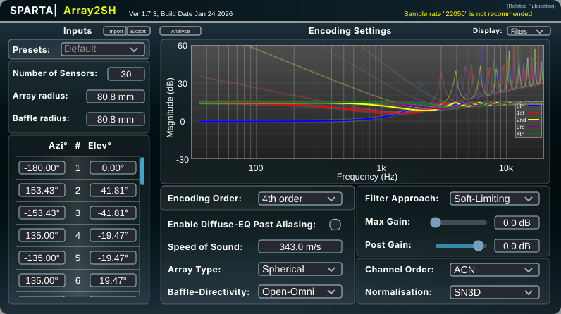
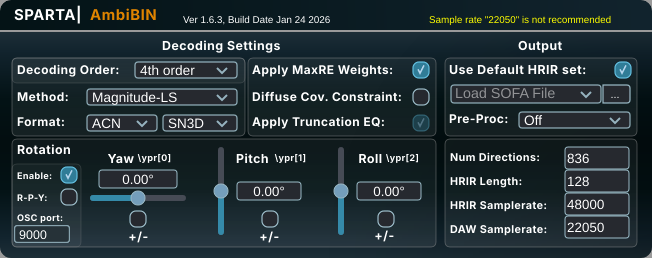

### Monophonic Examples (`mono` subdirectory)

For some of the following monophonic samples, the [`cli_tool`](../cli_tool/README.md) command used to generate them is
provided, as should be run in the project's root directory.
Enclosure sizes are provided in order *width x height x length*.

* [Voice speaking across a room, nearest neighbor receiver interpolation](mono/speech_nearest_interpolation.wav),
    * Enclosure size: 3m x 2.5m x 6m
    * Source position: (1m, 1m, 1m)
    * Receiver position: (2m, 1.8m, 5m)
    * Enclosure materials: Concrete walls, Wooden floor, Plaster ceiling

  (Generated using
  `./build/cli_tool/dwr3_cli   3 2.5 6   1 1 1   2 1.8 5   ./assets/cmu_arctic_us_axb_a0006.wav ./examples/mono/speech_nearest_interpolation.wav   72 3    0`)

* [Voice speaking across a room, linear receiver interpolation](mono/speech_linear_interpolation.wav),
    * Same parameters as previous example but with output sampling interpolation turned on.

  (Generated using
  `./build/cli_tool/dwr3_cli   3 2.5 6   1 1 1   2 1.8 5   ./assets/cmu_arctic_us_axb_a0006.wav ./examples/mono/speech_linear_interpolation.wav   72 3    1`)

All the samples from now on use output linear interpolation.

* [Doing the dishes, far from source, materials setup #1](mono/dishes_far_1.wav),
    * Enclosure size: 3m x 2.5m x 6m
    * Source position: (1m, 1.1m, 1m)
    * Receiver position: (2.5m, 1.75m, 5.5m)
    * Enclosure materials: Concrete walls, Wooden floor, Plaster ceiling

  (Generated using
  `./build/cli_tool/dwr3_cli   3 2.5 6   1 1.1 1   2.5 1.75 5.5   ./assets/doing_the_dishes.wav ./examples/mono/dishes_far_1.wav   100 -15    1`)

* [Doing the dishes, far from source, materials setup #2](mono/dishes_far_2.wav),
    * Same enclosure and positions parameters as previous example.
    * Enclosure materials: Concrete walls, floor, and ceiling

* [Doing the dishes, far from source, materials setup #3](mono/dishes_far_3.wav),
    * Same enclosure and positions parameters as previous example.
    * Enclosure materials: Acoustic absorber (|R|=0 for all frequencies) walls, floor, and ceiling

* [Receiver moving towards, then away from, an alarm siren #1](mono/alarm_siren_moving_02mps.wav), movement speed: 2m/s,
* [Receiver moving towards, then away from, an alarm siren #2](mono/alarm_siren_moving_05mps.wav), movement speed: 5m/s,
* [Receiver moving towards, then away from, an alarm siren #2](mono/alarm_siren_moving_10mps.wav), movement speed: 10m/s

### Binaural Examples (`binaural` subdirectory)

The following examples have been obtained via the [DAW plugin](../plugin/README.md) alongsides
the [SPARTA](https://leomccormack.github.io/sparta-site/)
Array2SH and AmbiBIN plugins.

The DAW plugin's relevant settings are specified for each example, with the 30 receivers layout being used for each
example.
The Array2SH and AmbiBIN settings used for these samples are the following:

* Voice from 8 different
  directions [(original samples source)](https://github.com/alsa-project/alsa-utils/tree/master/speaker-test/samples):
  the listener is positioned at the center of a square room with ceiling height of 2.5m and variable floor size
  and boundary materials,
    * All acoustic absorber
      boundaries: [2m x 2m floor](binaural/directions_absorber_2x2.wav), [3m x 3m floor](binaural/directions_absorber_3x3.wav), [4m x 4m floor](binaural/directions_absorber_4x4.wav)
    * Concrete walls, wooden floor, plaster
      ceiling: [2m x 2m floor](binaural/directions_room_2x2.wav), [3m x 3m floor](binaural/directions_room_3x3.wav), [4m x 4m floor](binaural/directions_room_4x4.wav)
    * All concrete
      boundaries: [2m x 2m floor](binaural/directions_concrete_2x2.wav), [3m x 3m floor](binaural/directions_concrete_3x3.wav), [4m x 4m floor](binaural/directions_concrete_4x4.wav)

* String quartet [(original samples source)](https://zenodo.org/records/4955282):
  the listener is positioned in front of a string quartet in a 5m x 3m room with ceiling height of 2.5m.
  Each instrument is played at 1 meter of distance from each other (from left to right: cello, viola, violin 1, violin
  2).
    * [Concrete side boundaries, wooden floor, all other boundaries with absorber material](binaural/quartet_custom.wav)
    * [All concrete boundaries](binaural/quartet_concrete.wav)

* Buzzing insect flying around the room [(original samples source)](https://soundbible.com/971-Bee.html#): the acoustic
  source starts at the opposite side of the room, moves towards the listener, orbits around the listener head in
  different
  patterns to then return to the starting side.
  The room is characterized by a floor of 2m x 5m, with ceiling height of 2.5m.
    * [All acoustic absorber boundaries](binaural/fly_absorber.wav)
    * [Concrete walls, wooden floor, plaster ceiling](binaural/fly_room.wav)
