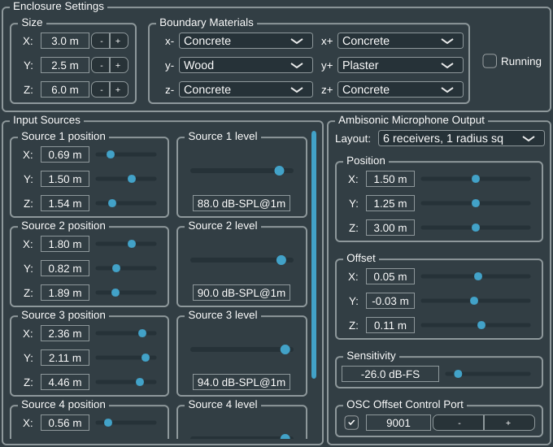

### DAW Plugin

The dynamic wave-based simulation model has been implemented as a DAW plugin.

This DAW plugin receives multiple audio channels as input, each reporting the discrete-time pressure values produced by
the respective sound source, and outputs multiple signals from receiver positions arranged to resemble similar spherical
layouts to those of Ambisonics microphones. It's implementation has been tested with
the [Reaper DAW](https://www.reaper.fm/).

#### Usage and parameters:

The room can be parameterized with a given size in meters and a material for each boundary side.

Once a desired room configuration has been selected, the "Running" toggle can be enabled to start processing the
real-time simulation. Likewise, it can be stopped by turning off the same toggle.

Source excitation can be scaled in terms of emitted dB-SPL at one meter of distance from the source, likewise
receiver sensitivity can be scaled in terms of dB-FS level.

The output receivers layout can be selected from a number of presets with an increasing amount of receiver points,
arranged spherically.
To enable practical usage with other plugins, such as those from
the [SPARTA](https://leomccormack.github.io/sparta-site/)
project, presets are provided in the [`array2sh_presets`](array2sh_presets/INFO.md) directory, with the [
`INFO.md`](array2sh_presets/INFO.md) file providing each layout's radius in millimeters given a specific sample rate.

Some [binaural rendering examples](../examples/README.md#binaural-examples-binaural-subdirectory) are provided, which
have been obtained with this plugin alongsides those of the SPARTA project. The configuration of the plugins is
provided.

The output microphone position can be controlled via position parameters spanning the entire room with the "base"
coordinates, alongsides "offset" parameters which are meant to be modulated via OSC messages, received from the
specified port with the format `/xyz` and three floating point values. For this purpose, a fork of
[opentrack](https://github.com/J0ySF/opentrack-DWR3-SPARTA-OSC) has been developed, enabling to set the user's base
position in the room via the plugin's UI, which is then offset dynamically with the user's tracked position:
this enables rendering from the user's perspective.

> Note: there is no requirement on coordinate system used for room size and individual coordinates,
> but it's suggested to use X+ right, Y+ up, Z+ forward since it's the convention used in the [
array2sh presets](array2sh_presets/INFO.md)
> and by [opentrack](https://github.com/J0ySF/opentrack-DWR3-SPARTA-OSC)'s messages.